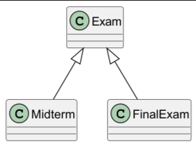

# Question 2
## a)
### 1) Correct A
``
Explaination:
Our program runs as following: it creates a new object of Test then it prints it
 "Calling toString()".
``
#####
``
Since Test extends Exam then the compiler will add super(); at the beginning
of the constructor of Test, so we get Correc then we print t -> "Correct"
``
#####
``
The second stage is to call toString() which will print " A" as the counter = 1;
``

### 2) Object - Overriding

### 3) Compiler error as we need a no-argument constructor to be defined so that the constructor of Test class could work.
-   note that java compiler creates a no-argument constructor only in case you didn't write any other constructors.

### 4) In case you defined other non-empty constructors.

### 5) Variables: Constant, Classes: can't be extended, Methods: can't be overridden.

## b)
### 1) 1 -> because FinalExam extends Exam, so due to the inheritance chain, we can conclude that FinalExam is Exam.

### 2) 

### 3) No. if we swapped line 2 and line 3, then f will be a data field (member) instead of being a local variable inside main method, then f must be static to allow its usage inside main method as it's a static method.

